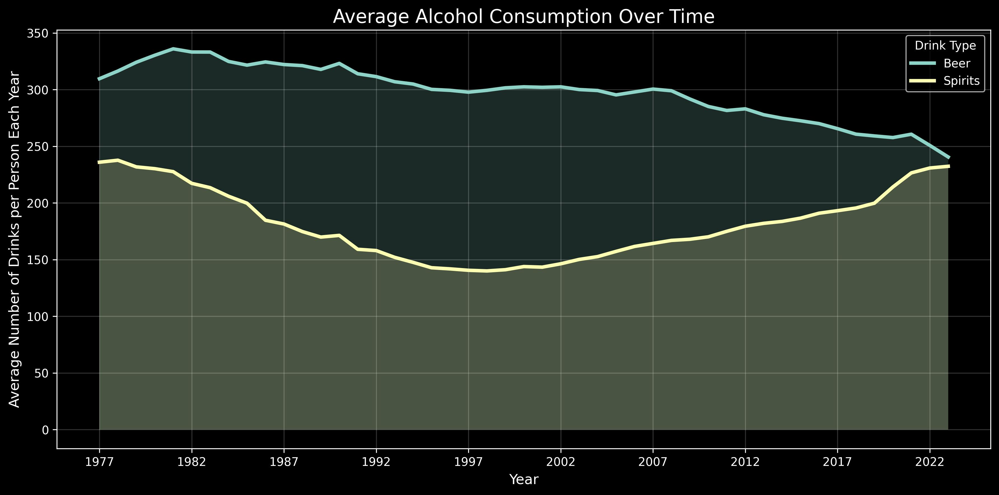

# cintel-03-signal-design

[](#)
[](./LICENSE)

> Professional Python project for continuous intelligence.

Continuous intelligence systems monitor data streams, detect change, and respond in real time.
This course builds those capabilities through working projects.

In the age of generative AI, durable skills are grounded in real work:
setting up a professional environment,
reading and running code,
understanding the logic,
and pushing work to a shared repository.

---

## This Project

This project introduces signal design.

The original example uses system metrics such as requests, errors, and latency.

In this version, I applied the same signal design techniques to a different problem:

alcohol consumption data

The goal is to:
- read real-world data
- create useful signals from raw values
- generate a CSV artifact
- visualize trends using a chart

---

## Custom Application (Alcohol Signal Design)

This project extends the original example by analyzing alcohol consumption data.

Signals created:
- beer_share_signal
- spirit_share_signal
- total_selected_signal
- total_drinks_signal

Outputs:
- artifacts/signals_consumption.csv
- artifacts/consumption_chart.jpg

---

## Example Chart



This chart shows alcohol consumption trends over time.

X-axis: Year
Y-axis: Average number of drinks per person each year

The lines compare beer and spirits consumption.

---

## Key Insights

- Alcohol consumption trends change over time
- Beer and spirits contribute differently to total consumption
- Signals make the dataset easier to understand than raw values
- Visualization makes long-term trends easier to see

---

## Data

This project uses alcohol consumption data with:

- year
- state_name
- ethanol_beer_gallons_per_capita
- ethanol_spirit_gallons_per_capita
- ethanol_all_drinks_gallons_per_capita
- number_of_beers
- number_of_shots_liquor
- number_of_drinks_total

Each row represents a state in a given year.

---

## Working Files

- data/ - raw dataset
- docs/ - project explanation
- src/cintel/ - signal design pipeline
- artifacts/ - output files
- pyproject.toml - project config
- zensical.toml - documentation config

---

## Setup

Open the repository in VS Code.

Install dependencies:

uv sync

---

## Run the Project

uv run python -m cintel.signal_design_custom_brandon

---

## Output Files

After running:

artifacts/signals_consumption.csv
artifacts/consumption_chart.jpg

---

## Instructions

Follow the workflow guide:

https://denisecase.github.io/pro-analytics-02/workflow-b-apply-example-project/

---

## Success

When successful, the program outputs:

```shell
========================
Pipeline executed successfully!
========================
```

---

## Command Reference

### In a machine terminal (open in your Repos folder)

git clone https://github.com/Brandon112123/cintel-03-signal-design
cd cintel-03-signal-design
code .

### In a VS Code terminal

```bash
uv self update
uv python pin 3.14
uv sync --extra dev --extra docs --upgrade

uvx pre-commit install
git add -A
uvx pre-commit run --all-files

uv run python -m cintel.signal_design_case
uv run python -m cintel.signal_design_brandon
uv run python -m cintel.signal_design_custom_brandon

uv run ruff format .
uv run ruff check . --fix
uv run zensical build

git add -A
git commit -m "update"
git push -u origin main
```
---

## Updates Made

- Applied signal design to alcohol dataset
- Created new signals for beer and spirits
- Added chart visualization
- Saved outputs to artifacts folder

---

## Changes I Observed

- Reduced outputs from 12 signals to 4 clearer signals
- Signals became easier to interpret
- Visualization made trends easier to understand
